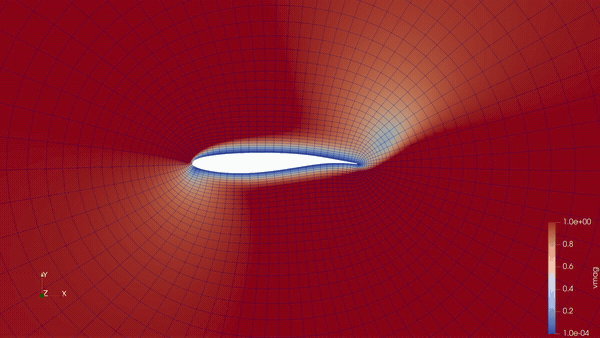

# vorti2d

2-D incompressible Navier–Stokes in **vorticity–streamfunction** form on a
curvilinear O-grid (Garmann metrics), solved with a fully-coupled, fully-implicit
Newton/dual-time scheme. This is a generalized Fortran + Python port of the
MATLAB course solvers (CFD Project 3 = steady, Project 4 = unsteady).

<p align="center">
  
  
</p>
<p align="center"><em>Left: vortex shedding past a cylinder at Re=100 (St≈0.16, mean Cd≈1.31).
Right: separated flow past an OAT15A airfoil at angle of attack. Vorticity field,
rendered in ParaView from the solver's XDMF/HDF5 output.</em></p>

* **Fortran compute kernels** (metrics + sparse assembly), wrapped with **f2py**.
* **PETSc + MUMPS** parallel direct solve, driven from Python via **petsc4py**.
* One unified solver: **steady is the `1/Δt → 0` limit of unsteady**.
* **Restart** (checkpoint/resume) support.
* Runs in parallel: `mpirun -np 4 python run.py`.

## Architecture (and why it's factored this way)

```
            ┌─────────────────────── Python (orchestration) ───────────────────────┐
 mesh CSV ─▶│ mesh.py  →  metrics ─┐                                                │
            │                      ▼                                                │
            │  solver.py: outer physical-time loop (BDF2)                           │
            │             inner pseudo-time Newton loop                             │
            │                │                                                      │
            │                ▼  assemble_coo (FORTRAN)   ──▶  petsc_solver.py        │
            │       COO triplets + RHS for owned rows         (PETSc AIJ + MUMPS LU, │
            │                                                  MPI, parallel solve)  │
            └───────────────────────────────────────────────────────────────────────┘
                              ▲
            ┌─────────────────┴──────────── Fortran (vorti2d_core) ─────────────────┐
            │  compute_metrics  : grid (x,y) → Jac, α, β, γ, P, Q, ηx, ηy           │
            │  assemble_coo     : state (ψ,ω,history) → block COO matrix + RHS      │
            │  NO PETSc / NO MPI / NO I/O  — pure array→array compute               │
            └───────────────────────────────────────────────────────────────────────┘
```

The Fortran kernels are the **only** code that touches the physics, and they
have zero external dependencies. That is deliberate:

* **GPU path (end goal: DNS).** `compute_metrics` and `assemble_coo` are
  embarrassingly parallel over grid nodes (each node computes its own stencil
  entries). They are the single surface to re-implement in CUDA / OpenACC /
  cuSPARSE later — nothing else changes. Precision is a one-line switch in
  `src/fortran/vorti2d_prec.f90` (+ the matching `.f2py_f2cmap`).
* **MPI lives only in Python** (`petsc_solver.py`), so f2py stays trivial and
  there are no Fortran/PETSc symbol conflicts. `mpirun -np N` gives each rank a
  contiguous slice of the global rows; MUMPS factorizes in parallel.

## Install

Requires a Python environment with gfortran, numpy, scipy, h5py, mpi4py and a
petsc4py built against a MUMPS-enabled PETSc (plus `meson` + `ninja` for the
f2py build on numpy ≥ 1.26 / Python ≥ 3.12). The development env is the venv at
`$HOME/packages/myenv`.

```bash
source $HOME/packages/myenv/bin/activate
cd vorti2d
make build                              # compile the f2py _core kernels
pip install -e . --no-build-isolation   # install the package (importable anywhere)
```

`make install` does both steps. (`petsc4py` / `mpi4py` / `h5py` come from the env
and are intentionally not pip dependencies.) The build auto-selects the f2py
backend: legacy `numpy.distutils` if present, otherwise the `meson` backend
(numpy ≥ 1.26 / Python ≥ 3.12 dropped `numpy.distutils`).

## Usage

Create a mesh. Three ways to supply one:

```bash
# 1. bundled cylinder O-grid generator
vorti2d-mesh --imax 181 --jmax 181 --inner-rad 0.5 --outer-rad 50 --xg xg.csv --yg yg.csv

# 2. any mesh as two CSVs of shape imax x jmax  ->  Config(mesh_xg=, mesh_yg=)

# 3. a pyHyp O-grid (cylinder / airfoil / any closed curve), read DIRECTLY:
#       Config(mesh_cgns="mesh.cgns")           # no pre-conversion needed
#    Generate one with  pyHypMesh/gen_ogrid.py  (see pyHypMesh/README.md).
```

**Angle of attack.** `Config(alpha_deg=...)` rotates the *free stream* (far-field
`psi = cos(a)*y - sin(a)*x`, `ome = 0`), so one grid serves any incidence — no
need to rotate or regenerate the mesh.

Run (serial or parallel — same script):

```bash
mpirun -np 4 python examples/cylinder_unsteady.py   # Re=100 cylinder shedding
mpirun -np 4 python examples/airfoil_unsteady.py    # OAT15A airfoil at incidence
python examples/strouhal.py examples/run_cylinder/out --plot   # lift history / St
```

Minimal driver:

```python
import vorti2d as v
cfg = v.Config(re=60.0, steady=False, dt_phys=0.2, t_end=50.0,
               rot_speed=0.5, rot_until=2.0,       # impulsive shedding 'kick'
               mesh_xg="xg.csv", mesh_yg="yg.csv", out_dir="out",
               restart_out="restart.npz", restart_every=50)
v.run(cfg)                  # steady: just set steady=True
```

**Steady vs unsteady:** `steady=True` solves a single pseudo-time problem to
convergence (no physical-time term). `steady=False` runs the BDF2 dual-time
scheme. Same code path, same kernels.

**Restart:** every run writes `restart_out` (in `out_dir`) at the end and every
`restart_every` steps. Resume with `Config(..., restart_in="out/restart.npz")`.
Restart is self-correcting because the Dirichlet boundary rows use the residual
form (`y−ψ`, `−ψ`, `−ω`) rather than hardcoded zeros.

## Output

* **`out/fields.xmf` + `out/fields.h5`** — XDMF/HDF5 time series for **ParaView /
  Tecplot / VisIt**. The curvilinear O-grid is written once (`2DSMesh`) and the
  `psi`/`omega` fields are appended per saved step as a temporal collection (open
  `fields.xmf`; ParaView shows a time slider). Toggle with `Config(write_xdmf=…)`.
* **`out/forces.csv`** — force/moment coefficients per physical step:
  `t, cd, cl, cm, cdp, cdf, clp, clf, cmp, cmf` (total + pressure/friction split).
  Toggle with `Config(compute_forces=…)`; see **Force coefficients** below.
* `out/psi_data/psi_t####.csv`, `out/omega_data/omega_t####.csv` — flattened
  fields per physical step, in the same layout as the MATLAB reference (for
  direct diffing). `####` is `round(t/Δt)`. Toggle with `Config(write_csv=…)`.
* `out/residual_data/residual_history_t####.csv` — inner-iteration residuals.
* `out/xg.csv`, `out/yg.csv` — the grid.
* `out/restart.npz` — checkpoint.

### Force / moment coefficients

`forces.py` integrates the surface traction on the wall (the `j=1` O-grid
boundary) following Ingham (*Steady flow past a rotating cylinder*, Computers &
Fluids 1983, eqns 15–24) and Thress et al. (2022, eqns 34–35): the **friction**
part is set by the wall vorticity and the **pressure** part is recovered by
integrating the wall-tangential momentum balance `dP/ds = −(1/Re) dω/dn`. It is
geometry-general (uses only physical node coordinates + the exported metrics),
so it works for any O-grid clustering, not just the bundled cylinder.

`Cd = 2·Fx/d`, `Cl = 2·Fy/d`, `Cm = 2·Mz/d²`, with reference length `d`
(`Config(ref_length=…)`; default = body diameter from the wall) and moment
reference `Config(moment_center=(x0,y0))`. Validated against Ingham Table 1
(Problem III): steady non-rotating cylinder gives `Cd ≈ 2.03` at `Re=20`
(Ingham 1.998) and `Cd ≈ 4.04` at `Re=5` (Ingham 4.109) — both the pressure and
friction parts match to ~2% at the `r=50` domain. This also confirms **vorti2d's
`Re` is diameter-based** (`U·d/ν`).

### Velocity post-processor (parallel)

To visualise `u`, `v` (and optionally `|V|`) instead of fiddling with `psi`/`ω`
contour levels, reconstruct the velocity from the streamfunction
(`u = ∂ψ/∂y`, `v = −∂ψ/∂x`, via the curvilinear metrics):

```bash
python -m vorti2d.postprocess out --mag           # serial
mpirun -np 4 python -m vorti2d.postprocess out --mag   # snapshots split across ranks
vorti2d-postprocess out --mag                      # installed entry point
```

It reads the run's `fields.h5` (or the legacy `psi_data/*.csv`), distributes the
snapshots across MPI ranks, and writes `out/velocity.xmf` (+ per-rank
`velocity_p##.h5`) as its own XDMF time series.

## Verification

```bash
python tests/check_parallel.py            # serial reference
mpirun -np 4 python tests/check_parallel.py --compare   # must match to ~1e-12
```

Serial, `-np 2`, and `-np 4` agree to machine precision (MUMPS is direct).
The steady solver reproduces the MATLAB convergence behaviour (~6 inner
iterations) and satisfies the boundary conditions to machine precision.

## Generalizations vs. the original MATLAB

* Steady and unsteady unified into one solver.
* Restart-safe **residual-form** boundary conditions.
* Wall rotation angle taken from physical coordinates (`cosθ=x/r`, `sinθ=y/r`),
  so the wall BC works for any O-grid, not just the bundled clustering.
* Mesh decoupled from the solver (supplied as CSV; generator is a utility).
* **Bug fix for non-square grids:** the convective `AOmeOme(k,n/s)` terms now
  use `2·Δη` (mathematically correct) where the MATLAB used `2·Δξ`. The two are
  identical when `Δξ = Δη` (e.g. the 181×181 grid), so results match the
  reference there, but the code is now correct for `imax ≠ jmax`.

## Known first-pass limitations (next steps)

* **State is replicated on every rank** (assembly reads the whole field). Correct
  and simple, but the thing to replace with a ghosted/domain-decomposed state
  for DNS-scale problems.
* PETSc here is the `real-debug` build (`-O0`); use an optimized PETSc build for
  performance runs.
* Only the cylinder O-grid generator is provided; general mesh import (CGNS/
  plot3d) is a planned drop-in for `mesh.py`.

## License

vorti2d is released under the GNU Library General Public License, version 2.0
(LGPL-2.0). See [LICENSE](LICENSE).
