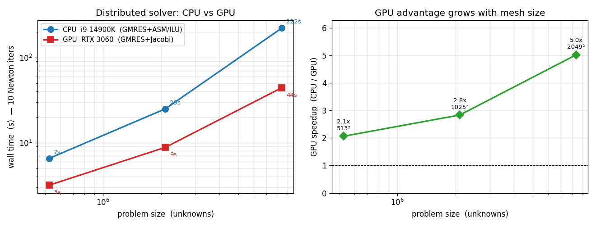

.. _vorti2d_parallel:

Parallel and GPU solver
=======================
vorti2d has two solver paths.  The default **replicated** solver holds the full
field on every rank and solves with PETSc/MUMPS (the direct, bit-for-bit
validated reference).  The **distributed** solver domain-decomposes the state so
a DNS-scale mesh fits across ranks, and solves iteratively -- on the CPU or the
GPU.

Selecting the distributed solver
--------------------------------
Set ``Config.distributed = True`` and choose a ``linsolve``::

    cfg = v.Config(re=80.0, steady=False, dt_phys=0.2, t_end=200.0, dtau=1.0,
                   mesh_xg="xg.csv", mesh_yg="yg.csv", out_dir="out",
                   distributed=True, linsolve="gmres_asm")
    v.run(cfg)

The same ``v.run`` entry point dispatches to the distributed solver; output
(forces, XDMF/HDF5, restart) is identical.  A ready example is
``examples/cylinder_dns.py``.

How it works
------------
* **1-D circumferential domain decomposition** via a PETSc ``DMDA``: each rank
  owns a wedge of the circumferential index ``i`` with the full radial range, so
  only width-1 halo columns are exchanged each pseudo-iteration (the branch cut
  is handled by the periodic ghost layer).  See ``vorti2d.domain``.
* The Fortran assembler emits the owned rows of the coupled system in
  node-interleaved (``dof=2``) ordering; the state never leaves PETSc, so the
  vector / matrix types can switch to GPU at runtime.
* The replicated solver is kept as the reference: ``tests/test_distributed.py``
  checks the distributed result equals it to ``~1e-13`` (serial and parallel,
  steady and unsteady).

Linear solvers (``Config.linsolve``)
------------------------------------
.. list-table::
   :header-rows: 1
   :widths: 22 16 62

   * - ``linsolve``
     - target
     - notes
   * - ``"mumps"``
     - CPU (ref)
     - direct LU; exact but does not strong-scale (the DNS bottleneck)
   * - ``"gmres_asm"``
     - **CPU**
     - GMRES + Additive-Schwarz/ILU.  The CPU optimum here.
   * - ``"gmres_jacobi"`` (alias ``"gpu"``)
     - **GPU**
     - GMRES + point-Jacobi.  Fully parallel (no serial triangular solve) -- the
       right GPU preconditioner.
   * - ``"gmres_fs"``
     - --
     - GMRES + FieldSplit.  Available but **not recommended**: the psi/ome
       coupling is too strong to split (slower than ASM).

The system is convection-dominated, so an iterative preconditioner is essential.
``gmres_asm``/``gmres_jacobi`` need a **finite** ``dtau`` (dual-time) or unsteady
mode so the diagonal stays dominant; pure Newton (``dtau=inf``) does not converge
iteratively.

Running on the GPU
------------------
The GPU path is ``linsolve="gmres_jacobi"`` plus PETSc runtime options that make
the DMDA allocate CUDA vectors and a cuSPARSE matrix:

.. prompt:: bash

    PETSC_OPTIONS="-dm_vec_type cuda -dm_mat_type aijcusparse -use_gpu_aware_mpi 0" \
    python run.py        # run.py sets distributed=True, linsolve="gmres_jacobi"

* ``-use_gpu_aware_mpi 0`` is required unless the MPI was built GPU-aware
  (PETSc aborts otherwise).
* Keep ``Config.ksp_restart`` modest on large meshes (``~60``): the GMRES Krylov
  basis lives on the GPU, and ``restart * 2*ndof`` doubles can exceed the card's
  memory (e.g. ``restart=200`` overflows a 12 GB card at ~4 M unknowns).

**Why Jacobi on the GPU.**  ILU is the best CPU preconditioner but its triangular
solve is inherently serial -- catastrophic on a GPU.  Jacobi is fully parallel
(sparse mat-vec + diagonal scale), so the GPU's memory bandwidth wins decisively
when the system is well-conditioned and Jacobi converges quickly.

.. IMPORTANT::

    The GPU ``gmres_jacobi`` path is fast **only in the well-conditioned regime**
    -- a steady, diffusion-dominated flow (low cell-Peclet) where Jacobi needs a
    mesh-independent handful of iterations.  A real convection-dominated DNS makes
    the coupled system ill-conditioned and Jacobi (and every other GPU-parallel
    preconditioner) fails -- see :ref:`what works, and what does not
    <vorti2d_parallel_limits>`.  Use the **CPU** ``gmres_asm`` solver for real
    DNS.  Reproduce the GPU-vs-CPU scaling above with ``tools/gpu_scaling.sh``.

Scaling
-------
Steady cylinder benchmark (10 fixed Newton iterations, single rank), CPU
(i9-14900K, ``gmres_asm``) vs GPU (RTX 3060, ``gmres_jacobi``):

.. list-table::
   :header-rows: 1
   :widths: 18 22 20 20 20

   * - mesh
     - unknowns
     - CPU (ILU)
     - GPU (Jacobi)
     - GPU speedup
   * - :math:`513^2`
     - 0.53 M
     - ``6.5 s``
     - ``3.2 s``
     - :math:`2.0\times`
   * - :math:`1025^2`
     - 2.1 M
     - ``25 s``
     - ``8.8 s``
     - :math:`2.8\times`
   * - :math:`2049^2`
     - 8.4 M
     - ``222 s``
     - ``44 s``
     - :math:`5.0\times`

    The GPU advantage grows with mesh size -- bigger problems amortise the
    overhead and exploit the GPU's memory bandwidth.  Reproduce with
    ``examples/scaling_bench.py`` (data in ``tools/scaling_data.csv``, figure
    from ``tools/plot_scaling.py``).

On a single desktop the CPU path saturates the one memory controller at ~8 ranks
(the i9-14900K's 8 performance cores); the GPU sidesteps that with its much
higher bandwidth.

.. _vorti2d_parallel_limits:

What works, and what does not (yet)
-----------------------------------
**Validated / working:**

* Distributed solver == replicated/MUMPS reference to ``~1e-13`` (serial and
  parallel; **steady and unsteady**) on the **CPU**.
* **CPU is the production DNS solver** (``gmres_asm``): GMRES + ASM/ILU works on
  real convection-dominated flow.  Validated, scales to the desktop's memory
  bandwidth (~8 ranks).
* **GPU works for the well-conditioned regime** (``gmres_jacobi`` +
  ``aijcusparse``): a steady, diffusion-dominated flow (e.g. the cylinder from
  rest) converges in a mesh-independent handful of Jacobi iterations, and the GPU
  beats the CPU 2--5x with the advantage growing with mesh size (the scaling
  above).  Reproduce with ``tools/gpu_scaling.sh``.
* Distributed restart (write **and** resume) -- a resumed run reproduces a
  continuous one exactly; forces / XDMF / CSV output, all matching the
  replicated solver.

**Not working / open (a research problem, not an engineering gap):**

* **No GPU solver for fully-coupled, convection-dominated DNS.**  The CPU ``ILU``
  works because it factors the *whole* coupled matrix -- capturing the
  streamfunction/vorticity coupling -- but that factorization is inherently
  serial (GPU-hostile).  Every GPU-*parallel* preconditioner approximates the
  coupling away and then needs hundreds-to-thousands of iterations regardless of
  how well the blocks are solved.  Tested and rejected: Jacobi (1400+ iters),
  FieldSplit with AMG (700+), AMG on the full matrix (fails), Schur complement
  (3000+), and a segregated Gauss--Seidel scheme (unstable).  **NVIDIA AMGx is
  mesh-independent on each isolated elliptic block** (the psi-Poisson and the
  diffusion-dominated omega block) -- the obstacle is purely the coupling.  This
  is the open lever (a coupling-aware GPU preconditioner, or a different
  discretization); the AMGx build is the foundation for it.
* **GPU is slower than CPU on small/easy problems** (below ~:math:`10^6`
  unknowns): GPU init + the per-iteration host->device matrix transfer dominate;
  the win appears only at DNS scale.  ``MatSetValuesCOO`` (PETSc >= 3.23) would
  give GPU-resident assembly and remove the transfer.
* The mesh is still **broadcast** to every rank at setup (per-iteration state is
  distributed; only the metric arrays are localised), capping the very largest
  meshes by per-rank setup memory.
