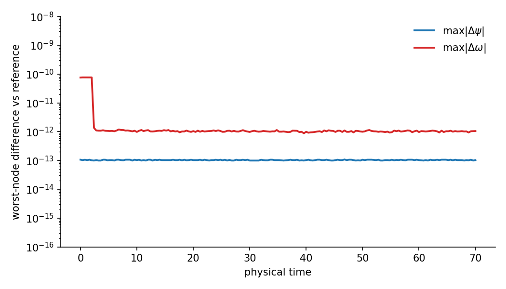
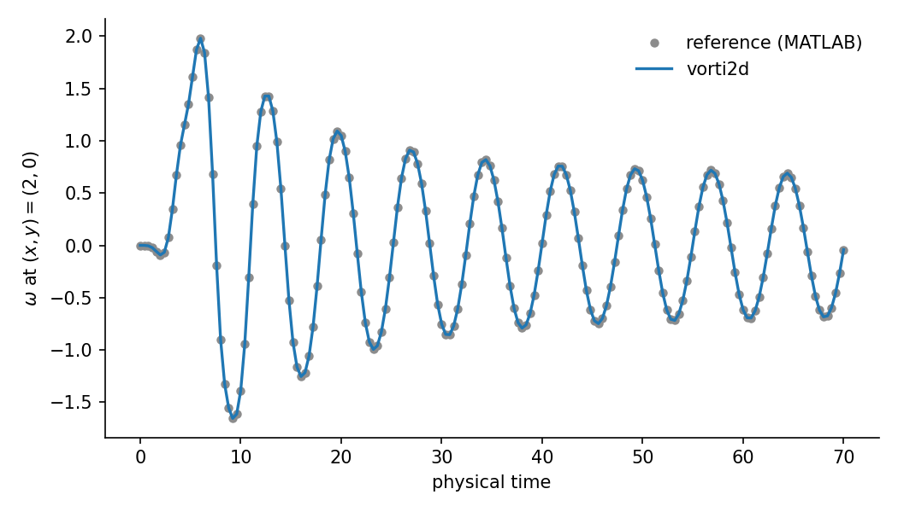
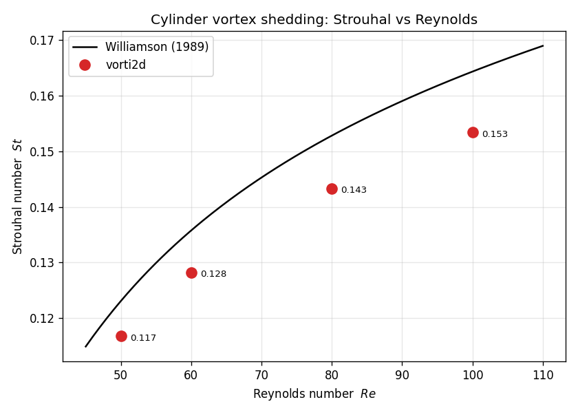

.. _vorti2d_verification:

Verification and Validation
===========================
Following standard CFD practice the two are kept distinct:

* **Verification** asks *are we solving the equations right?* -- that the code
  reproduces a known reference, is independent of the parallel decomposition, and
  converges at the design order of accuracy.
* **Validation** asks *are we solving the right equations?* -- that the computed
  flow matches physical reality (experiment / accepted correlations).

Verification
------------
Unless noted, comparisons use the production resolution of ``181 x 181``.

Mesh generator
~~~~~~~~~~~~~~
The built-in cylinder O-grid generator reproduces the reference mesh to machine
precision:

.. math::

    \max|x_g - x_g^{\mathrm{ref}}| \approx 5.7\times 10^{-14}, \qquad
    \max|y_g - y_g^{\mathrm{ref}}| \approx 5.7\times 10^{-14}.

Parallel consistency
~~~~~~~~~~~~~~~~~~~~~
Because MUMPS is a direct solver, the result must be independent of the number
of MPI ranks.
For a steady case, the serial solution and the ``mpirun -np 2`` and
``mpirun -np 4`` solutions agree to roughly machine precision:

.. list-table::
   :header-rows: 1
   :widths: 30 35 35

   * - Comparison
     - ``max|delta psi|``
     - ``max|delta omega|``
   * - serial vs ``-np 2``
     - :math:`7\times10^{-15}`
     - :math:`7\times10^{-15}`
   * - serial vs ``-np 4``
     - :math:`7\times10^{-15}`
     - :math:`5\times10^{-15}`

Reference-solver agreement, :math:`Re = 60`
~~~~~~~~~~~~~~~~~~~~~~~~~~~~~~~~~~~~~~~~~~~~~
vorti2d is a port of a reference MATLAB solver; the two must agree to round-off
on the same problem.
The unsteady, vortex-shedding case was run to :math:`t = 70` with a physical
time step of ``0.2`` and the impulsive rotational kick (``rot_speed = 0.5`` for
``t <= 2``), matching the reference run exactly.
Over all 351 physical steps and all 32{,}761 nodes, the fields agree with the
reference to machine precision throughout the entire simulation, including the
full oscillatory wake transient:

.. list-table::
   :header-rows: 1
   :widths: 40 30 30

   * - Quantity
     - Worst-case over all steps
     - Relative
   * - streamfunction :math:`\psi`
     - :math:`1.1\times10^{-13}`
     - :math:`\sim 2\times10^{-15}`
   * - vorticity :math:`\omega`
     - :math:`7.7\times10^{-11}` (during the kick, at the solver tolerance)
     - :math:`\sim 7\times10^{-14}`

    Worst-node field difference between vorti2d and the reference solver at each
    physical step.  The agreement stays at the round-off / solver-tolerance
    floor for the whole run; there is no drift.

The wake vorticity was probed at :math:`(x, y) = (2, 0)`, following the
reference post-processing.
The kick excites an oscillation in the wake that then slowly decays over the
run; the two probe signals are indistinguishable over the whole record:

.. list-table::
   :header-rows: 1
   :widths: 50 25 25

   * - Quantity
     - vorti2d
     - reference
   * - probe agreement, :math:`\max|\Delta\omega|`
     - :math:`2.6\times10^{-14}`
     - --
   * - oscillation frequency
     - matches
     - matches
   * - peak amplitude (early, :math:`t \approx 6`)
     - ``1.98``
     - ``1.98``

    Wake vorticity at :math:`(x, y) = (2, 0)` versus time, vorti2d (line)
    overlaid on the reference solver (markers).  The curves coincide through the
    entire (decaying) wake oscillation.

.. NOTE::

    At this condition the kick-excited wake oscillation decays over the run -- a
    stable, non-chaotic trajectory -- so two solvers started from the same state
    track each other to round-off.  For chaotic / turbulent flows
    (high-:math:`Re` DNS) instantaneous fields would eventually diverge in phase
    even for a correct solver, and verification should then be statistical
    (frequencies, amplitudes, mean profiles).

.. NOTE::

    **Planned:** a spatial / temporal order-of-accuracy study (grid triplet at
    fixed steady :math:`Re`, and a physical-time-step refinement of the unsteady
    shedding case) to demonstrate the design second-order convergence by
    Richardson extrapolation.

Validation
----------

Steady drag vs Ingham
~~~~~~~~~~~~~~~~~~~~~~
For steady flow past the cylinder the computed drag coefficient matches the
classic Ingham :cite:p:`Ingham1983` results, on both the analytic O-grid and a
pyHyp-generated one (see :ref:`meshing <vorti2d_meshing>`):

.. list-table::
   :header-rows: 1
   :widths: 22 26 26 26

   * - :math:`C_d`
     - vorti2d (analytic grid)
     - vorti2d (pyHyp grid)
     - Ingham (1983)
   * - :math:`Re = 20`
     - ``2.036``
     - ``2.035``
     - ``1.998``
   * - :math:`Re = 40`
     - ``1.522``
     - ``1.519``
     - ``~1.50``

The lift is symmetric to :math:`\sim 10^{-11}`, confirming the orientation and
boundary conditions.

Strouhal number vs Williamson
~~~~~~~~~~~~~~~~~~~~~~~~~~~~~~~
For unsteady shedding the natural validation quantity is the Strouhal number
:math:`St = f D / U` of the lift oscillation (here :math:`St = f`, since
:math:`D = U = 1`).  The cylinder is run to a saturated limit cycle at
:math:`Re = 50, 60, 80, 100` -- all within the laminar parallel-shedding regime
(onset near :math:`Re \approx 47`) -- and the measured :math:`St` is compared
with the Williamson :cite:p:`Williamson1989` correlation

.. math::

    St = -\frac{3.3265}{Re} + 0.1816 + 1.6\times10^{-4}\,Re,
    \qquad 49 \lesssim Re \lesssim 178 .

The frequency is measured from the **saturated limit cycle only**: a start-up
transient (driven by the impulsive kick) precedes a constant-amplitude shed, so
``examples/lco_frequency.py`` automatically locates the trailing window where the
per-cycle :math:`C_l` amplitude stops changing and measures :math:`St` there from
peak-to-peak, trough-to-trough and zero-crossing timing (the three agree to
:math:`\pm 0.001`, so the frequency is not limited by FFT resolution).
``examples/validation_strouhal.py`` does this for all four runs and produces the
figure:

.. prompt:: bash

    python examples/validation_strouhal.py 50:run_cylinder_re_50/out \
        60:run_cylinder_re_60/out 80:run_cylinder_re_80/out \
        100:run_cylinder_re_100/out --out docs/images/strouhal_validation.png

.. list-table::
   :header-rows: 1
   :widths: 16 28 28 28

   * - :math:`Re`
     - :math:`St` (vorti2d)
     - :math:`St` (Williamson)
     - deviation
   * - 50
     - ``0.1167``
     - ``0.1231``
     - :math:`-5.2\%`
   * - 60
     - ``0.1282``
     - ``0.1358``
     - :math:`-5.6\%`
   * - 80
     - ``0.1433``
     - ``0.1528``
     - :math:`-6.2\%`
   * - 100
     - ``0.1535``
     - ``0.1643``
     - :math:`-6.6\%`

    Cylinder shedding Strouhal number at :math:`Re = 50, 60, 80, 100` (saturated
    limit cycle) overlaid on the Williamson (1989) parallel-shedding correlation.
    The :math:`St(Re)` trend is captured; the points sit a near-uniform
    :math:`\sim 6\%` below the correlation.

The frequency itself is well resolved: measured from the saturated cycle it is
constant across the record to within the :math:`\Delta t = 0.2` peak-time
quantization, so the offset is **not** a saturation or measurement artifact.

No grid-convergence or time-step-convergence study was performed for this set --
each case uses a single mesh and a fixed physical time step
(:math:`\Delta t = 0.2`) -- so the solutions are not formally grid- or
time-step-converged, which accounts for the :math:`\sim 6\%` offset.  A separate
finer-grid :math:`Re = 100` run already shifts :math:`St` from ``0.154`` toward
``0.159`` (and a finer :math:`\Delta t` likewise raises it), confirming the
discrepancy is numerical discretization rather than a modelling error.  The
purpose here is the qualitative :math:`St(Re)` trend, which is reproduced; a
formal convergence study is noted as future work.

.. NOTE::

    At the lowest Reynolds numbers (:math:`Re = 50, 60`) the shedding amplitude
    is small (:math:`C_{l,\mathrm{amp}} \sim 0.02`--:math:`0.08`) and the
    transient is long, so these runs must be carried much further in time
    (:math:`t \gtrsim 150`) than the higher-:math:`Re` cases to expose a clean
    saturated cycle.
